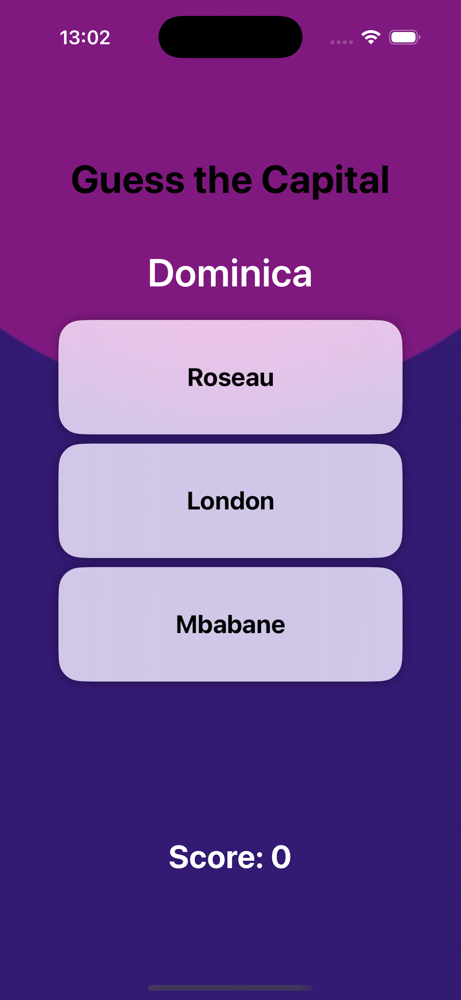

# GuesTheFlag

It is an iOS app/game that asks the user to guess the flag for a given country.

- A Game of Flags
- A Game of Capitals
- Remembers the high score
- Shows a confetti effect every time the user beats his high score

## Screens

| Main                                                 | Game                                                |  Game  Capitals                                         |   Effect                                                          |
|------------------------------------------------------|-----------------------------------------------------|-----------------------------------------------------|-----------------------------------------------------------------|
|  |  |  |  |

## Flags

The flags used are from https://github.com/lipis/flag-icons converted and resized from SVG to fit the use case.

## Translations

- [x] English
- [x] German
- [x] Bulgarian